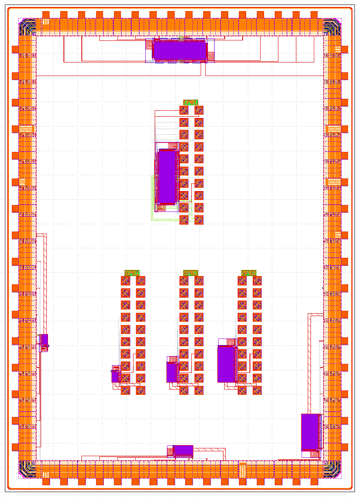
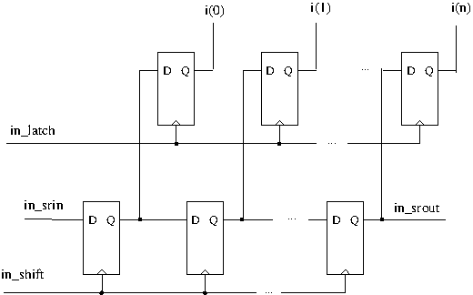
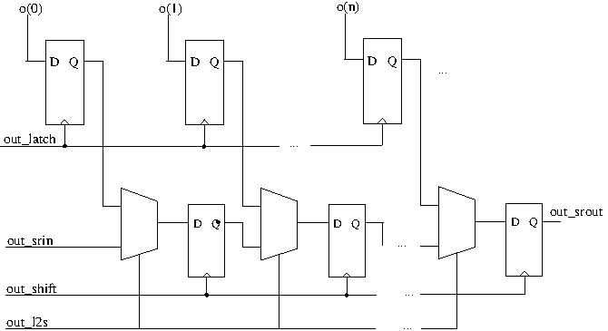
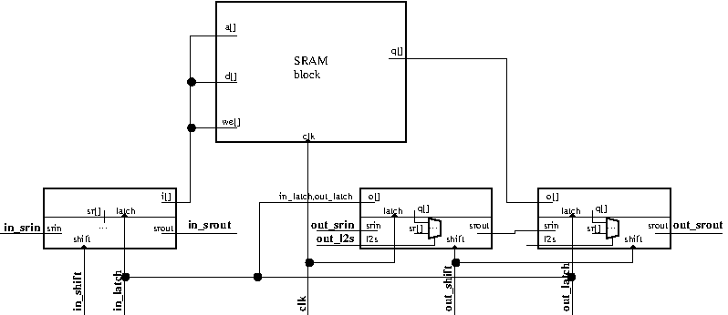
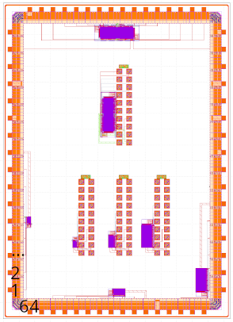
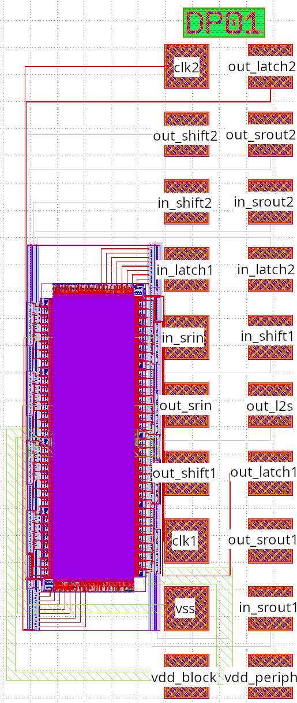
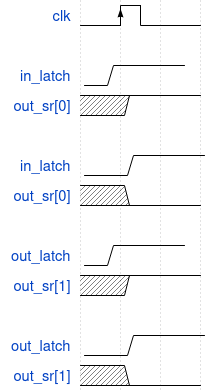
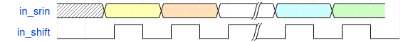
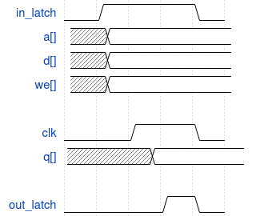
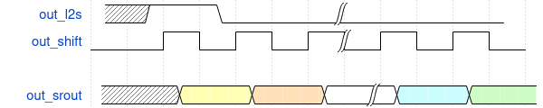

# SRAM blocks test structures including timing

This is design for test structures to verify functionality and timing of some SRAM blocks generated by the WIP SRAM compiler being developed in the FlowSpace project.

## Contents

Layout of the testchip (without fillers):

The testchip consists of four SRAM blocks with shift registers on input and output that allows to test the functionality and timing of the blocks with reduced number of pins. The four SRAM blocks are:

* SP01: single port, 128x8, 1 we signal
* SP02: single port, 256x16, 2 we signals
* SP03: single port, 512x32, 4 we signals
* DP01: dual port, 512x32, 4 we signals

Each of the blocks is put on the testchip twice. One time connected to a padring to test the SRAM blocks on a packaged chip. One time connected out to a pad frame to test the SRAM blocks with a probe card on wafer.

The single port has `a` input for the address and `d` input for the value to write to an address during a write operation. In these block one `we` signal is available for each 8 bits which allows to determine on byte if the value is read or written. The block has a `q` output that gets the read value for a read operation. The SRAM is write through which means that for a write operation `q` will get the value of the `d`. The SRAM block is clocked with `clk` signal and it starts an operation on the rising edge of `clk`. `a`, `d` and `we` are latched into internal registers also on the rising edge of `clk`.

The dual port RAM was designed to contain two asynchronous ports that both can do read and write. It has does the double set of signals: `a1`/`d1`/`we1`/`q1`/`clk1` for port and `a2`/`d2`/`we2`/`q2`/`clk2` for port 2. After this test block was taped more in-depth verification design was performed and deviations were found resulting in needing to run the two ports synchronously and some intermingling of the address input. In the verification section more details are given on the history of this deviation.

## Test periphery

For the single port SRAM blocks a shift register for the inputs of the SRAM block and a shift register for the outputs of the SRAM block and the on-chip delay calibration of the latching signals is added to the SRAM block itself. For the dual port SRAM a set of these shift register is present for each port of the block.

### SRAM inputs shift register

The inputs shift register consists of a shift register with input `in_srin` and output `in_srout` and the clock `in_shift`. The provided `in_srout` signal can also be used as input for another shift register. There is also a second set of registers and they will latch the contents of the shift register with the `in_latch` signal. The output of this set of register is then connected to the inputs of the SRAM block. This way the timing of the inputs of the SRAM is controlled by this `in_latch` signal.

### SRAM outputs shift register

For the SRAM outputs shift register the `out_latch` signal will capture the outputs of the SRAM block in a set of register. When `out_l2s` is high the outputs of this set is then connected to the inputs of the shift register by a MUX. When `out_l2s` is low the output of the previous register in the shift register is connect to the input of the next register. `out_shift` is then the clock for the shift register. So after having latched the outputs into the set of registers using `out_latch`, one `out_shift` cycle needs to be done with `out_l2s` high followed by several `out_shift` cycles with `out_l2s` low to shift out the value of the captured outputs. Also here a `out_srin` is provided that can be used to connect the output of another shift register to the input of this shift register.

### Top block

Above picture shows how this is combined on the top block. The order of the bits in the shift register will be documented below.

## SRAM blocks test chip pin-outs and shift register order

### SRAM test block signals

In order to measure the power consumption of the block independent of the test periphery, the block gets a separate supply. The ground is shared between both the periphery and the block. These extra signals combined with the inputs and outputs test periphery described above gives the following signals and supplies for each single port SRAM block:

* vss
* vdd_periph
* vdd_block
* clk
* in_srin
* in_srout
* in_shift
* in_latch
* out_srin
* out_srout
* out_shift
* out_l2s
* out_latch

For the dual port SRAM the test periphery is put on the chip for each port and also each port has it's own clock. This gives the following signals and supplies:

* vss
* vdd_periph
* vdd_block
* clk1
* in_srin1
* in_srout1
* in_shift1
* in_latch1
* out_srin1
* out_srout1
* out_shift1
* out_l2s1
* out_latch1
* clk2
* in_srin2
* in_srout2
* in_shift2
* in_latch2
* out_srin2
* out_srout2
* out_shift2
* out_l2s2
* out_latch2

### SRAM test block shift register signals

In [SR_Signals.ods](SR_Signals.ods) the signal order in each shift register for each SRAM block can be found. The impact of the design deviations found on the dual port RAM are indicated with intended signal in red color and struckthrough followed by the actual signal. See verification section for more information on the change of the signals.

### Pad ring signals

In order to facilitate the packaging of the test chip a pad frame is used with the same bond pad location as the TinyTapeout and Greyhound chips. This pad frame has 64 pins. In order to avoid simultaneous switching output problems we want to put several IOPadIOVdd/IOPadIOVss pairs in the pad ring. When this is combined with all the signals of the SRAM blocks this would lead to too many signals. Therefor it was decided to drive all the `*_srin` signals with one common `srin` signal.

For the pin numbering we take 1 for the bottom bond pad on the left side of the pad ring and then number the pins clock-wise. In [PadRing_PinOut.ods](PadRing_PinOut.ods) you can then find the signals corresponding with each bond pad and the internal connection to the SRAM block.

As the ports of the dual port block can't be run asynchronously the input pins `dp8t1_clk1` and `dp8t1_clk2` have been changed to `dp8t1_clk` signal and both signals have to be driven by the same external signal. This assumes on-chip delay of both signals is the same.

**TODO: pin numbers need to be updated when package is selected for packaging**

### Probe card pad frame signals

All the three single port SRAMs have the same pin out to the probe card pad frame. In the following picture the example for SP01 is given:

This is the pin out for the dual port SRAM:

In order to fit all signals in the 20 pad frame three signals have been shared between port 1 and 2. `in_srin` is connected to `in_srin1` and `in_srin2`; `out_srin` to `out_srin1` and `out_srin2` and `out_l2s` to `out_l2s1` and `out_l2s2`. The pin out has been designed such that test procedures for testing the single port SRAM can be reused on port 1 of the dual port SRAM if `clk2`, `in_shift2`, `in_latch2`, `out_shift2` and `out_latch2` are kept low and `in_srout2` and `out_srout2` are left floating.

As said in the contents section, for the dual port block on this design, port 1 and port 2 can't be used asynchronously so clk1 and clk2 signal have to be driven by the same signal. This assumes on-chip delay for the two signals are the same.

## Measurement procedures

### Measurement timings

An operation on the SRAM block is done in 3 phases: `shift_in`, `execute` and `shift_out`. There is a timing sequence to calibrate on-chip delay `delay_cal`.

___delay_cal___

As seen in the schema of the top block above the first two bits of the output shit register are latched by the `clk` signal and the inputs are `in_latch` and `out_latch`. By varying the rising edge of `in_latch` and `out_latch` relative to the one of `clk` different values will be latched into the output shift register as shown in the picture. This is locally to the SRAM block and thus includes the on-chip delay.

___shift_in___

For shifting in data for the SRAM input signals one clocks `in_shift` with providing the serial data on `in_srin`

___execute___

In the execute cycle first a rising edge on `in_latch` is done so the data shifted into the input shift register is put on the inputs of the SRAM block. Then a rising edge on `clk` is done to do the operation on the SRAM block which will then present the output `q[]` after a delay. Finally a rising edge on `out_latch` is done to latch the output into the output shift register.  
To complete the execute cycle `in_latch`, `clk` and `out_latch` are switched to low value. Relative timing of this falling edge is not important.  
In the sub-chapters below it is explained how variation in relative timing of the rising edge of `in_latch`, `clk` and `out_latch` can be used to measure setup and delay timings of the SRAM block.

___shift_out___

For shifting out data for the SRAM output signals one first does one clock cycle on `out_shift` with `out_l2s` high and further cycles with `out_l2s` low. In the first cycle the internal shift register is loaded with the latched SRAM output and the first bit already needs to be captured from `out_srout`. In the next cycles then each time `out_srout` has to be captured.

### Calibration of on-chip delays

In this procedure `in_latch` and `out_latch` is toggled a certain time after single rising edge `clk`. Afterwards the captured value of `in_latch` and `out_latch` by `clk` is read out of output shift register using one transfer cycle of `out_shift` with `out_l2s` high and then the needed `out_shift` cycles with `out_l2s` low to get the captured `in_latch` and `out_latch` values.

By shifting the time of the toggling of `in_latch` and `out_latch` relative to `clk` one can determine at which delay it goes from capturing the new value to capturing the old value.

### Functional and timing test

For these tests the same procedure is used for a single read and/or write cycle:

* Fill the input shift register with the right value to perform the wanted read or write operation using `in_srin` and `in_shift`
* Do one `in_latch` cycle to present the new input values to the SRAM inputs
* Do one `clk` cycle to perform the operation on the SRAM block
* Do one `out_latch` cycle to capture the outputs of the SRAM block
* Do one `out_shift` cycle with `out_l2s` high to transfer the captured outputs to the shift register
* Shift out the captured outputs using `out_srout` and `out_shift` while keeping `out_l2s` low.

*Functional verification*

For functional verification of the SRAN block this procedure is done with enough delay margin between `in_latch`, `clk` and `out_latch` to have no timing problems. This way SRAM block can be filled with values and read back to verify functionality of the block.

*`a` input timing*

Here typically the SRAM block is filled with known different values. Afterwards read cycles are performed with timing of `in_latch` shifted relative to `clk` and see from which point the wrong address is read.

*`d` input timing*

A procedure that can be used here:

* Write a value to an adress using the procedure described above using non-timing critical delays
* Write 2-bit opposite value to the same address using the procedure with delay shifting delay of `in_latch` to `clk`.
* Read out the value of the address using non-tioming cricical delays
* Determine at which delay the wrong value is written to the address

*`clk` to `q` timing*

Procedure:

* Initialize two addresses with 2-bit opposite values using non-timing critical procedure
* Read value from first address with non-timing critical procedure
* Read value of the other address with delay of `out_latch` shifted relative to `clk`.
* Determine at which delay the wrong value is read

### Static power consumption

This can be done by just powering the block and measure the current on it's dedicated supply. Typically this measurement is done at elevated temperatures as that will result in the highest leakage currents.

### Dynamic power consumption

This can be done by shifting the a read or write operation into the input shift register and then perform constant `clk` toggling at a certain frequency and measure the current on the SRAM dedicated supply. Each clock cycle the bitlines will be pre-charged and one of them will be unloaded; also one word line will always be loaded and unloaded. As this procedure will always read or write the same value from or to the same address this procedure will not include the decoder switching power or the sense amplifier switching power. This power is assumed to be small compared to the power consumed on the word lines and especially the bit lines.

## (Post tape-out) verification

The SRAM layout uses overlapping source/drain regions in between cells. At the time of tape-out this was not supported by the upstream LVS check. Therefor a semi-manual LVS check was done on the design before tape-out. After tape-out then a problem was found in the design: two signals that were supposed to be connected by abutment were not as the cells had been moved away from each other to fix a DRC error. This problem present in the column periphery cell that was used in all the four SRAM blocks so nothing would work due to this error.

A M2 fix has been submitted to fix this problem and in parallel an adaptation of the upstream LVS has been developed in order to be able to do LVS on the SRAM blocks with overlapping source/drain regions. Using this adapted check two other problems were identified on the dual port SRAM block:

1. Connection of row decoder of port1 to word lines of port 2 and vice versa.

    At the outside this can be seen as mixing of signals of port1 and port2 in the test shift register and that `clk1` and `clk2` need to be handled as one `clk` signal.

1. Column demultiplexing signals of second port were connect in opposite order.

   This can be seen on the test structures as the last two address bits being inverted for port2.

These two problems would need multi-mask fixes to correct and only affect the dual port SRAM block. When not fixed the test structures would still be usable to measure timing characteristic of this dual port block so it was decided to not go for a mask fix but to just document the deviation of the test structure from the originally wanted one.
