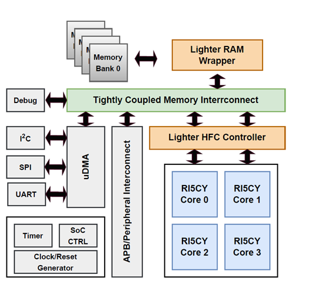

# Opensource TETRISC Design

openTETRISC is an adaptive, fault tolerant quad core RISC-V chip based on the open source Pulpissimo design. It is enriched by 1) 40kB SRAM 2) HiRel Framework Controller to enable cores individually and support reliability measures. The implementation is entirely based on open-source EDA tools and the IHP 130nm OpenPDK. openTETRISC aims at being a modular, fully open-source digital SoC with standard peripherals, serving as a reproducible reference design for open-source ASIC development flow. The RAM-Wrapper is a tool method to handle unaligned memory access

